# Practice

A new Flutter project for learning and practice flutter UI/UX design form scratch and get expert in flutter application developer.

## Day 1 

**First Day**, i will start form how to install and setup device and android studio for flutter development. 
1. Then i will create our first flutter application and understanding about flutter folder structure.
2. Then learned about how flutter application run and what is Widgets and Understanding about Scaffold, Text, Text.rich, TextSpan Widget.
3. Then design out Text style and Text decoration that said.

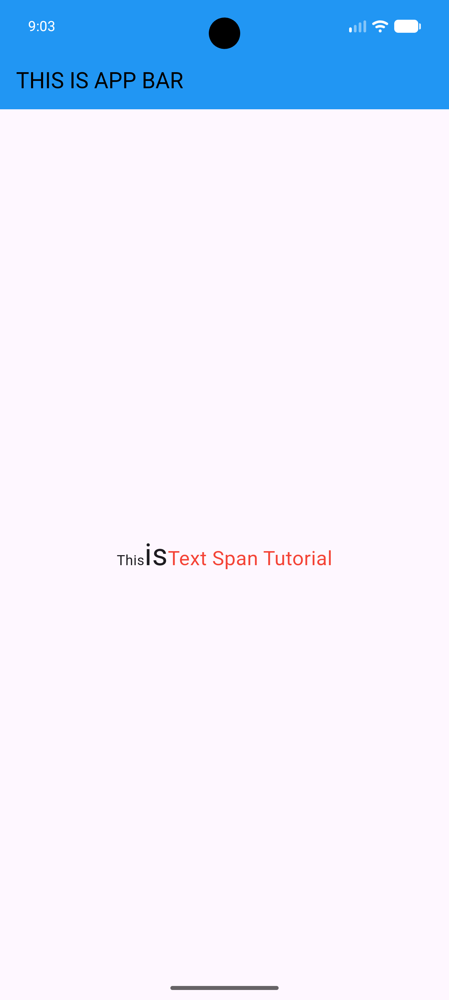

## Day 2

1. Learning about home: widget to navigate by default root directory of an application.
2. And also learning about how to generate random number in flutter application.

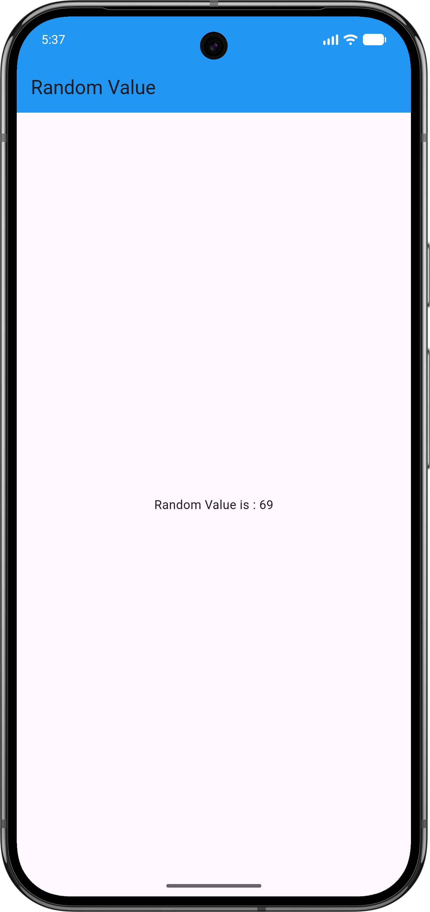

## Day 3

1. Learning about how to add image in flutter application.
2. How to add icons in flutter application.

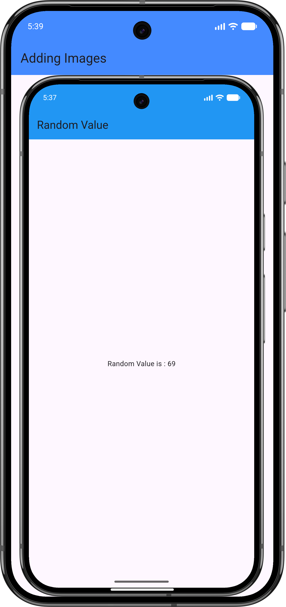
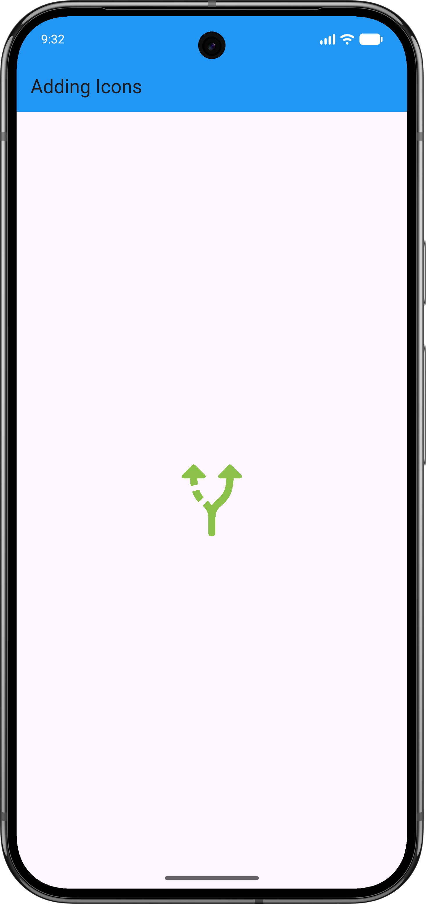

## Day 4 

1. Learning about container widget and how to design a container.
2. Then also learn about create and design a Elevated button.

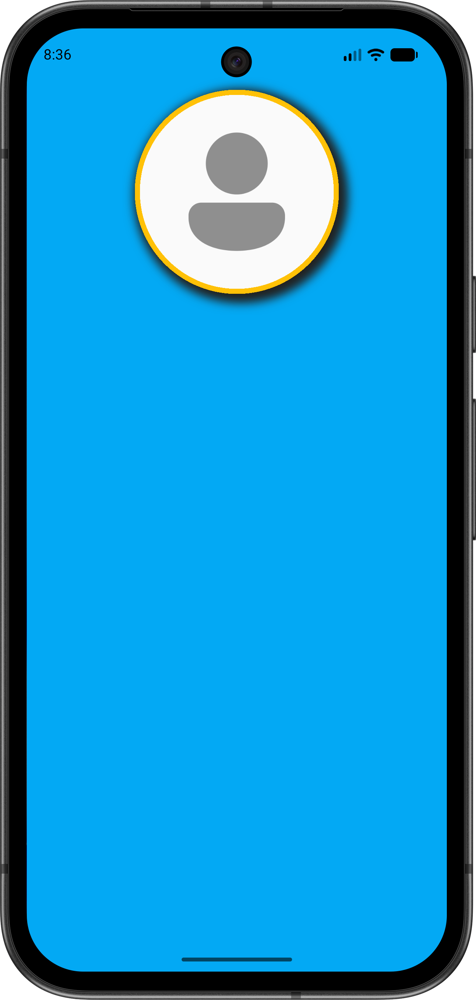
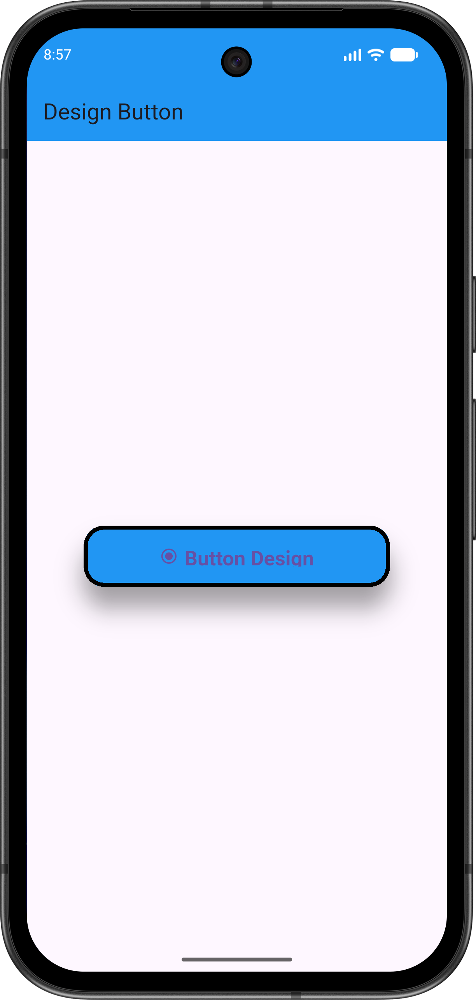

## Day5

1. Design a beautiful appbar and also add some icons in this appbar like shopping icon and search icon.
2. Also learning about how to create a listview for disply multiple list in a single screen.
3. Also learning about listvier builder and how to create a list view builder.

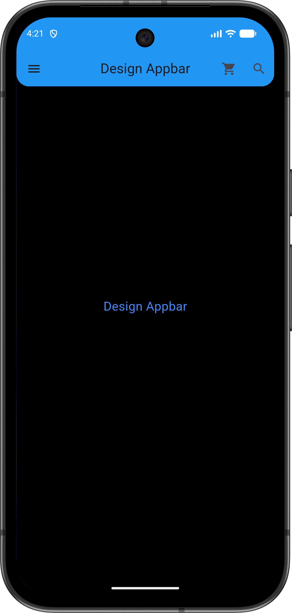
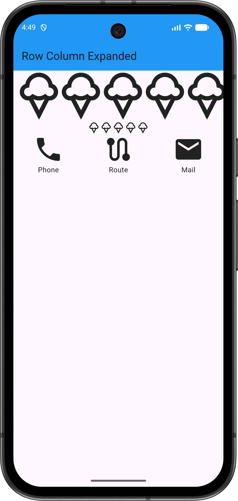
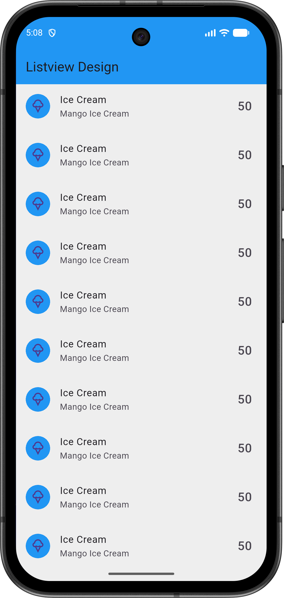

## Day6 

1. Understanding about floationg action button and how to create a floating action button.
2. And also learinig about stack widget and position widget.
3. And last one is, how to create a custom widget.

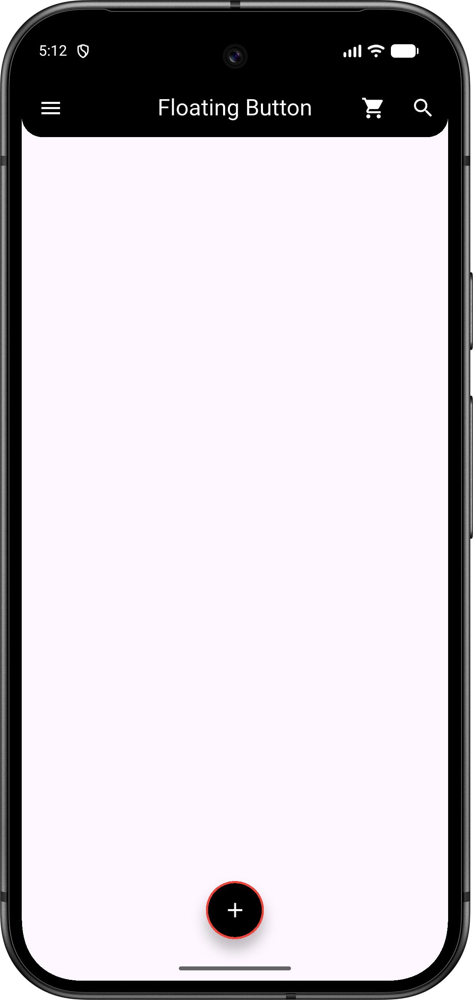

## Day7

1. Understanding about statefull widget and navigate one page to another.

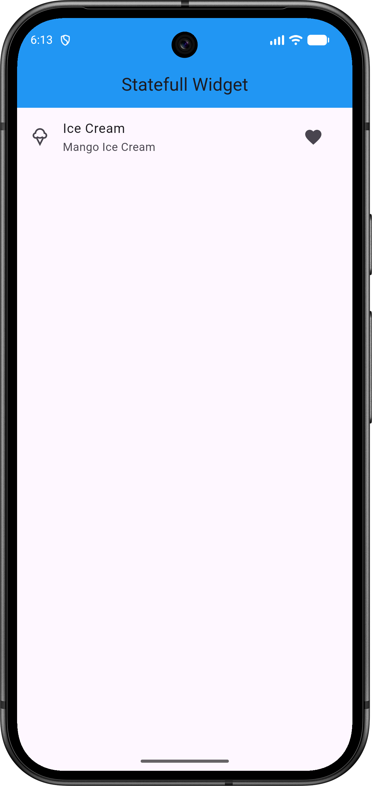
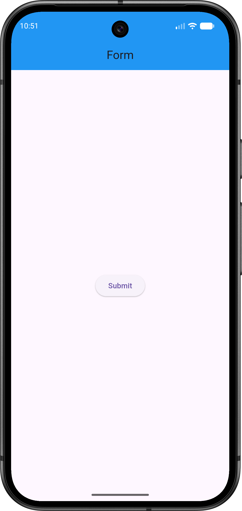

# Day8

1. Create a form and validate id and show the data in another screen.

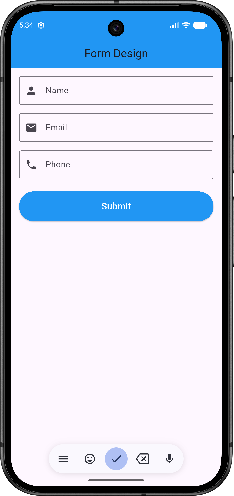

